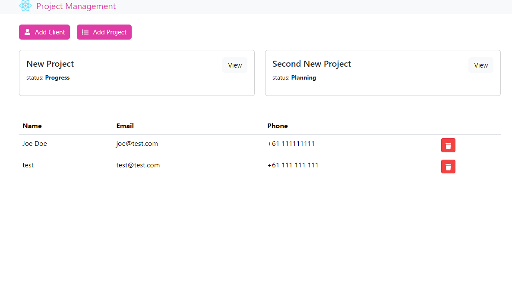

# Project Management Full Stack App

A full stack web application build with MERN stack with GraphQL.

# Functionality of this app

- Project Management application where users can add clients and projects. Clients and Projects will be linked together. Users can add, remove clients and can add, get details of projects, update project status and delete projects too.

# Installation

- to run in locally for education purpose
- Download or clone repository of [Project-mgmt-frontend](https://github.com/kartavya99/project-mgmt-frontend) & [Project-mgmt-backend](https://github.com/kartavya99/project-mgmt-backend)
- Node.js is required to run the application
- npm install to install the required packages as per package.json

# Usage

- use the following link to open the application
- The application will run on any browser.

# live application

[Project Management App deployed link](https://pro-mgmt-graphql.vercel.app/)

# Below are the sample images of deployed application

## Home Page

## Single Project Page

# Features and Technologies uses

- MongoDB
- Express.Js
- React.js
- Node.js
- GraphQl
- Redux-toolkit
- Apollo-Client
- apollo-server-express

## Under the MIT license

